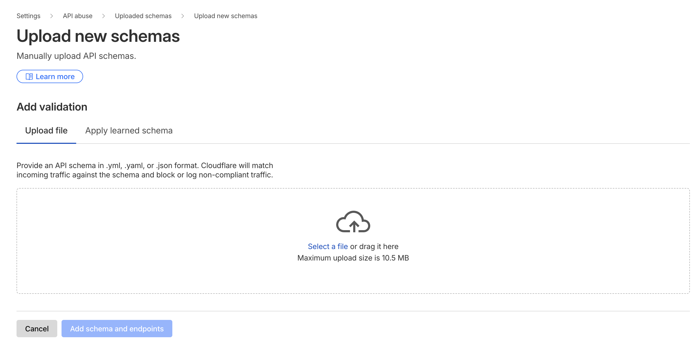

# API Shield Demo

A demo project for Cloudflare API Shield demonstrating **Schema Validation** and **JWT Validation** using Hono.js on Cloudflare Workers.

## Overview

This project implements a JWT authentication API with RS256 signing to test Cloudflare's API Shield capabilities:

- **Schema Validation**: OpenAPI 3.0 schema (`schema.json`) defines request/response validation rules
- **JWT Validation**: RS256-based JWT token generation and verification using JWK (JSON Web Keys)
- **Framework**: Hono.js for fast, lightweight routing on Cloudflare Workers
- **Deployment**: Custom domain routing

## Endpoints

### `GET /`
Health check endpoint that returns `"Hello Hono!"`

### `POST /token`
Generates a JWT token signed with RS256 algorithm using a private JWK.

**Response:**
```json
{
  "token": "eyJhbGciOiJSUzI1NiIsInR5cCI6IkpXVCJ9..."
}
```

### `POST /secure`
Validates JWT token from `Authorization` header and processes client credentials.

**Headers:**
```
Authorization: Bearer <token>
```

**Request Body:**
```json
{
  "clientId": "client_123",
  "clientSecret": "secret_abc123"
}
```

**Response:**
```json
{
  "clientId": "client_123",
  "clientSecret": "secret_abc123",
  "uid": "123456"
}
```

## Setup

### 1. Install Dependencies

```bash
npm install
```

### 2. Configure Wrangler

Create a `wrangler.jsonc` file from the example:

```bash
cp wrangler.jsonc.example wrangler.jsonc
```

Update the configuration with your custom domain or routes as needed.

### 3. Configure Environment Variables

Create a `.dev.vars` file with your JWK keys:

```bash
cp .dev.vars.example .dev.vars
```

Add your JWK keys (see `public-key-example.json` and `private-key-example.json` for format):

```
JWK_PRIVATE_KEY='{"kty":"RSA","e":"AQAB",...}'
JWK_PUBLIC_KEY='{"kty":"RSA","e":"AQAB",...}'
```

### 4. Generate Types (Optional)

Generate TypeScript types based on Worker configuration:

```bash
npm run cf-typegen
```

## Development

Start the local development server:

```bash
npm run dev
```

## Deployment

Deploy to Cloudflare Workers:

```bash
npm run deploy
```

### Production Secrets

Set secrets for production using Wrangler:

```bash
wrangler secret put JWK_PRIVATE_KEY
wrangler secret put JWK_PUBLIC_KEY
```

## API Shield Configuration

### Schema Validation

Cloudflare API Shield's Schema Validation protects your API by validating incoming requests against an OpenAPI 3.0 schema. Follow these steps to add and enforce schema validation:

#### Upload Schema via Dashboard (Recommended)

1. **Access API Shield**
   - Log in to the [Cloudflare dashboard](https://dash.cloudflare.com/)
   - Select your account and domain
   - Navigate to **Security** > **API Shield** (or **Web Assets** in the new dashboard)

2. **Add Schema Validation**
   - Go to the **Schema validation** tab
   - Click **Add validation**
   - Select **Upload a schema file**

3. **Upload Your Schema**
   - Choose your `schema.json` file
   - Review the listed endpoints (host, method, and path)
   - New endpoints will automatically be added to **Endpoint Management**

4. **Configure Mitigation Action**
   
   Choose an action for non-compliant requests:
   - **Log** - Monitor violations without blocking (recommended for testing)
   - **Block** - Reject requests that don't match the schema
   - **None** - Disable enforcement but keep the schema active

5. **Deploy Schema**
   - Click **Add schema and endpoints**
   - Wait a few minutes for changes to process (depends on number of endpoints)

6. **Verify Schema Status**
   - Go back to **Schema validation** tab
   - Confirm your schema appears in the list with status "Active"
   - Check that endpoints are properly registered



#### Enforcing Schema Validation

**Change Action for Entire Schema:**

1. Go to **Schema validation** tab
2. Select your schema from the list
3. Check the multi-select box to select all endpoints
4. Click **Change action**
5. Choose your enforcement action:
   - **Log** - Monitor mode (safe for production testing)
   - **Block** - Full enforcement (blocks invalid requests)
6. Click **Set action**

**Change Action for Individual Endpoint:**

1. Go to **Schema validation** tab
2. Find the specific endpoint
3. Click the action dropdown for that endpoint
4. Select your desired action
5. Changes apply immediately

### JWT Validation

Cloudflare API Shield's JWT Validation protects your API by validating JSON Web Tokens (JWTs) sent by clients. This ensures that only authenticated requests with valid tokens can access your protected endpoints.

JWT validation requires two main components:
1. **Token Configuration** - Defines your JWT issuer's public keys (JWKS) and where to find tokens in requests
2. **JWT Validation Rule** - Specifies which endpoints to protect and what action to take on invalid tokens

#### Prerequisites

Before configuring JWT validation:
- Endpoints must be added to **Endpoint Management** (either manually, via Schema Validation, or API Discovery)
- You need your JWT issuer's public JSON Web Key Set (JWKS)
  - Each JWT issuer typically publishes public keys at a known URL (e.g., `https://your-auth-provider.com/.well-known/jwks.json`)
  - If you don't know where to get them, contact your identity administrator
  - For this demo project, you can use the public key from `public-key-example.json`

#### Step 1: Add a Token Configuration

A token configuration tells Cloudflare where to find the JWT in incoming requests and provides the public keys needed to verify token signatures.

##### Using the Old Dashboard

1. **Access API Shield**
   - Log in to the [Cloudflare dashboard](https://dash.cloudflare.com/)
   - Select your account and domain
   - Navigate to **Security** > **API Shield** > **Settings**

2. **Create Token Configuration**
   - Under **JSON Web Token Settings**, click **Add configuration**
   - Enter a descriptive name for your configuration (e.g., "My API JWT Config")

3. **Specify Token Location**
   - Choose where Cloudflare should look for the JWT in incoming requests:
     - **Header** - Most common (e.g., `Authorization` header)
     - **Cookie** - For browser-based applications
     - **Query parameter** - Less common, not recommended for production
   - Enter the name (e.g., for Authorization header with Bearer scheme, use `Authorization`)

4. **Add Public Keys (JWKS)**
   - Copy your JWT issuer's public key set in JWKS format
   - Paste it into the **Public keys** field
   - The JWKS should be in JSON format with one or more keys

5. **Save Configuration**
   - Click **Save** to create the token configuration

##### Using the New Dashboard

1. **Access Security Settings**
   - Log in to the [Cloudflare dashboard](https://dash.cloudflare.com/)
   - Select your account and domain
   - Navigate to **Security** > **Settings**
   - Or use the direct link: [Go to Settings](https://dash.cloudflare.com/?to=/:account/:zone/security/settings)

2. **Filter and Configure**
   - Filter by **API abuse**
   - Under **Token configurations**, click **Configure tokens**

3. **Create Token Configuration**
   - Click **Add configuration**
   - Enter a descriptive name for your configuration

4. **Specify Token Location**
   - Choose the token source:
     - **Header** - Select this for Authorization headers
     - **Cookie** - For session-based authentication
   - Enter the name (e.g., `Authorization`)

5. **Add Public Keys (JWKS)**
   - Copy and paste your JWT issuer's public key(s) in JWKS format
   - Cloudflare supports multiple keys in a single JWKS for key rotation

6. **Save Configuration**
   - Click **Save** to create the token configuration

**💡 Pro Tip:** To automatically keep your JWKS up to date when your identity provider refreshes them, you can use a Cloudflare Worker. See the [official documentation](https://developers.cloudflare.com/api-shield/security/jwt-validation/jwt-worker/) for details.

#### Step 2: Add a JWT Validation Rule

A JWT validation rule applies your token configuration to specific endpoints and defines what happens when tokens are invalid or missing.

##### Using the Old Dashboard

1. **Access API Rules**
   - Log in to the [Cloudflare dashboard](https://dash.cloudflare.com/)
   - Select your account and domain
   - Navigate to **Security** > **API Shield** > **API Rules**

2. **Create New Rule**
   - Click **Add rule** or **Create rule**
   - Enter a descriptive name (e.g., "Validate JWTs on /secure endpoint")

3. **Select Hostname**
   - Choose the hostname to protect (e.g., `api.yourdomain.com`)
   - Only endpoints already saved in Endpoint Management will be available

4. **Select Endpoints**
   - All endpoints for the selected hostname will be selected by default
   - **Deselect** any endpoints that should NOT require JWT validation
   - For example, deselect the `/token` endpoint if it's used to generate JWTs

5. **Choose Token Configuration**
   - Select the token configuration you created in Step 1
   - This tells Cloudflare which public keys to use for validation

6. **Configure Token Presence Enforcement**
   - Choose how to handle requests without JWTs:
     - **Ignore** - Validate JWTs when present, but allow requests without tokens
     - **Mark as non-compliant** - Require all requests to include a JWT
   - For most APIs, choose **Mark as non-compliant** to enforce authentication

7. **Set Action for Non-Compliant Requests**
   - Choose what happens when validation fails:
     - **Log** - Record the violation but allow the request (good for testing)
     - **Block** - Reject invalid or missing JWTs (recommended for production)
     - **Challenge** - Present a challenge to the client
     - **JS Challenge** - JavaScript-based challenge
     - **Managed Challenge** - Cloudflare's intelligent challenge

8. **Save Rule**
   - Click **Save** to activate the JWT validation rule
   - Changes take effect within a few seconds

##### Using the New Dashboard

1. **Access Security Rules**
   - Log in to the [Cloudflare dashboard](https://dash.cloudflare.com/)
   - Select your account and domain
   - Navigate to **Security** > **Security rules**
   - Or use the direct link: [Go to Security rules](https://dash.cloudflare.com/?to=/:account/:zone/security/security-rules)

2. **Create JWT Validation Rule**
   - Under **API JWT validation rules**, click **Create rule**
   - Enter a descriptive name for your rule

3. **Select Hostname and Endpoints**
   - Choose the hostname to protect
   - All saved endpoints for that hostname will be selected
   - **Deselect** endpoints that should not require JWT validation (e.g., `/token` endpoint)

4. **Choose Token Configuration**
   - Select the token configuration created in Step 1
   - This links your public keys to this validation rule

5. **Configure Token Presence**
   - Choose enforcement level:
     - **Ignore** - Validate JWTs when present, allow requests without tokens
     - **Mark as non-compliant** - Require JWTs on all selected endpoints

6. **Set Action for Non-Compliant Requests**
   - Choose the action for invalid/missing JWTs:
     - **Log** - Monitor violations without blocking
     - **Block** - Reject non-compliant requests
     - **Challenge** - Present a challenge
     - **JS Challenge** - JavaScript challenge
     - **Managed Challenge** - Smart challenge

7. **Save Rule**
   - Click **Save** to deploy the rule
   - The rule becomes active immediately


## Project Structure

```
├── src/
│   └── index.ts               # Main Hono application with JWT endpoints
├── schema.json                # OpenAPI 3.0 schema for API Shield
├── wrangler.jsonc.example     # Example Cloudflare Workers configuration
├── .dev.vars.example          # Example environment variables
├── public-key-example.json    # Example JWK public key format
└── private-key-example.json   # Example JWK private key format
```

## Tech Stack

- **Hono.js** v4.9.12 - Fast web framework for Cloudflare Workers
- **Cloudflare Workers** - Serverless edge compute platform
- **Wrangler** v4.43.0 - Cloudflare Workers CLI
- **JWT with RS256** - Asymmetric token signing using JWK
